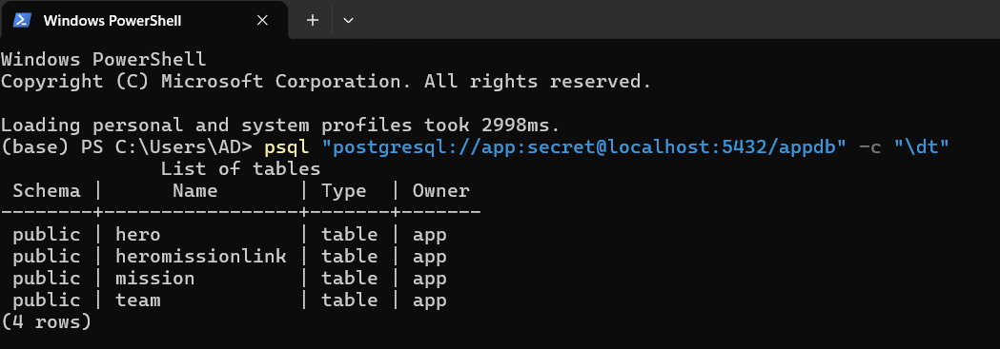
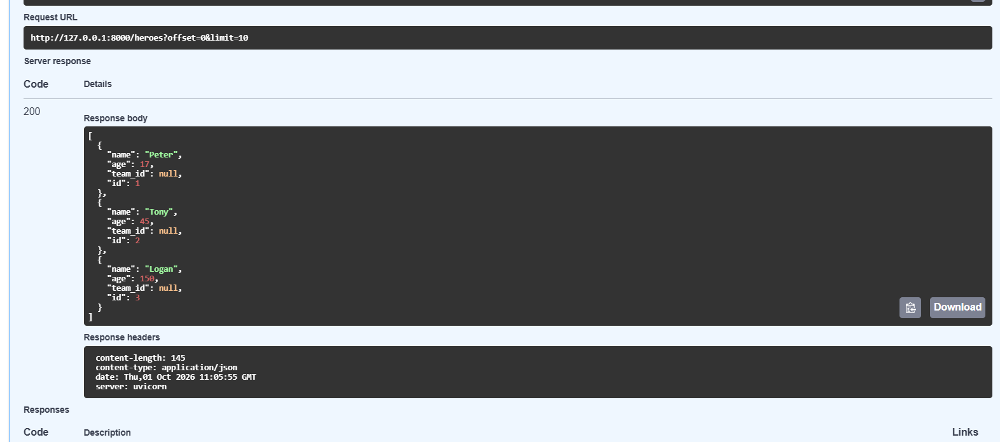
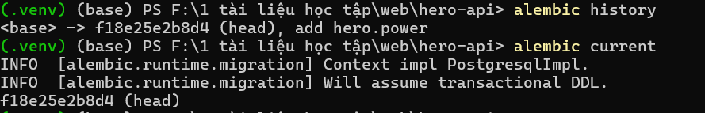

Question 1.
(a) Inserting the Avengers team a second time is blocked by UNIQUE, because the name is already in use.
(b) Inserting a hero with team_id = 99 is blocked by FOREIGN KEY, because no team has ID 99.
(c) Inserting a hero with only age is blocked by NOT NULL, because the name column is empty.
(d) Deleting team 1 is blocked by FOREIGN KEY, because Tony and Natasha are still referencing this team.

Question 2. A team has many heroes, but each hero belongs to only one team. Therefore, each hero row only needs to store one team_id. If a foreign key is set for the team, a cell must contain multiple hero_ids, which a single column cannot do.

Question 3. Three tables are needed: hero(id PK, name, age, team_id FK), mission(id PK, title), and a concatenated table hero_mission(hero_id FK, mission_id FK, PRIMARY KEY (hero_id, mission_id)). Each row in the join table is a hero-mission pair, so the many-to-many relationship is split into two one-to-many relationships.
Question 4:
Security. URLs contain usernames and passwords. Hardcoding them in code exposes the password when pushing code to Git or sharing it with others.

Flexibility. Development machines, test machines, and the live server use different databases. Using environment variables allows the same code to run everywhere; you just need to change the variable, not modify and rebuild the code.
Question 5.

When you create a Hero object in Python, it has not been saved yet, so it has no id. The id is generated by the database (a SERIAL column) when the row is inserted. If id were a required int, you could not create a Hero before saving it. Typing it as int | None with default=None lets you build the object without an id; after commit() and refresh(), SQLModel fills in the real number assigned by the database.

Question 6.

The attributes id, name, age, secret_name and team_id become columns. The attribute team does not: it is a Relationship, a Python-only attribute that lets you reach the related Team object without writing a JOIN yourself. The real column is team_id, the foreign key. back_populates links the two sides of one relationship: hero.team and team.heroes describe the same relationship, so when one side changes, the other side updates automatically.

Question 7.

The column types are the same (VARCHAR, INTEGER, SERIAL), but there are several differences. SQLAlchemy adds a new column, secret_name VARCHAR NOT NULL, because the model requires it; my hand-written table did not have it. SQLAlchemy also writes name VARCHAR NOT NULL and id SERIAL NOT NULL explicitly, and it declares the primary key and the foreign key as separate table-level constraints (PRIMARY KEY (id) and FOREIGN KEY(team_id) REFERENCES team (id)) instead of inline. The column order is different too (the base-class fields come first and id comes later). Finally, SQLAlchemy creates an index ix_hero_name on name with a separate CREATE INDEX statement, because the model uses Field(index=True); my hand-written table had no index. For team, unique=True together with index=True produces a unique index (ix_team_name) rather than the inline UNIQUE constraint I wrote by hand.

Question 8.

No, CREATE TABLE is not printed again. On startup create_all first checks the database to see which tables already exist, and it only creates the tables that are missing. When a table already exists, create_all skips it: it does not recreate it, drop it, or change its columns, so existing data is safe.
Question 9. c

The line from app.models import (the import of Hero, Team and the other models) in main.py. Importing the module executes models.py, and each class with table=True registers its table in SQLModel.metadata. create_all(engine) creates only the tables found in that metadata, so without this import it would create nothing.

Question 10. Without session.commit(), the request fails with a 500 Internal Server Error, because refresh() raises an error: the new object was only added to the session and was never inserted. The row is not in the database (SELECT \* FROM hero; shows nothing new), because the transaction is rolled back when the session closes. add() only places the object in the session as pending; commit() sends the INSERT and makes it permanent. refresh() then reloads the row from the database so the object gets values generated there, such as the id.

Question 11. UPDATE hero SET age=%(age)s::INTEGER WHERE hero.id = %(hero_id)s::INTEGER. It updates only age, not every column. The endpoint uses model_dump(exclude_unset=True), so only the fields the client sent are applied, and SQLAlchemy writes only the attributes that actually changed.

Question 12. No, secret_name is not in the JSON. The line response_model=HeroPublic in the endpoint decorator is responsible: HeroPublic has no secret_name field, so FastAPI filters it out before sending the response.

Question 13.

The printed statement is SELECT hero.name, hero.age, hero.team_id, hero.id, hero.secret_name FROM hero WHERE hero.age >= %(age_1)s::INTEGER AND hero.team_id = %(team_id_1)s::INTEGER ORDER BY hero.id LIMIT %(param_1)s::INTEGER OFFSET %(param_2)s::INTEGER. The values 18 and 1 do not appear inside the SQL text; they appear only in the separate parameter dictionary printed on the next line ({'age_1': 18, 'team_id_1': 1, ...}). This is safe because the values are sent as bound parameters, not pasted into the SQL string. The database treats them strictly as data, never as SQL code, so a malicious input such as 1; DROP TABLE hero cannot change the structure of the query.

Question 14.

Filtering in the database means only the matching rows are read and sent to the application, so less data travels over the network and less memory is used. The database can also use indexes and its optimized query engine, and it can apply ORDER BY, LIMIT and OFFSET for pagination. Loading every row into Python and filtering there wastes time and memory, and it becomes very slow and may even run out of memory as the table grows.
Question 15.

create_all creates only the tables that do not exist yet in the database. mission and heromissionlink were new in the metadata, so they were created. hero already existed, so it was skipped. The rule is: it never alters or drops an existing table, so it will not add new columns to a table that already exists.

Question 16.

The order was: team, then mission, then hero, then heromissionlink. Parent tables are inserted first, because other tables reference them through foreign keys. hero.team_id was filled automatically: the hero was linked to its team through the relationship (team=avengers), so SQLAlchemy inserted the team first, received its generated id (via RETURNING), and copied that id into hero.team_id when inserting the hero. The link table rows got hero_id and mission_id the same way.

Question 17.

No, \d hero shows no power column, because create_all does not modify existing tables. GET /heroes fails with a 500 Internal Server Error: the query selects hero.power, and the database answers column hero.power does not exist. Dropping all tables and recreating them is not acceptable in production because it deletes all the existing data. A migration changes the schema while keeping the data.

Question 18.

def upgrade() -> None:
op.add_column('hero', sa.Column('power', sqlmodel.sql.sqltypes.AutoString(), nullable=True))

def downgrade() -> None:
op.drop_column('hero', 'power')

upgrade() adds the nullable text column power to the hero table, so existing rows get NULL. downgrade() undoes the change by dropping the power column.

Question 19.

Alembic stores it in a table inside the database itself, alembic_version, which holds the id of the current revision (visible with \dt). The migrations/ folder should be committed to Git because it is the versioned history of the database schema: teammates and servers run alembic upgrade head to get exactly the same schema, and without these files nobody could reproduce or safely evolve the database.

Question 20.

Alembic generated op.add_column('hero', sa.Column('alias', ..., nullable=False)) followed by op.drop_column('hero', 'secret_name'). It cannot detect a rename, so it sees one column removed and one added. This is dangerous because dropping secret_name permanently destroys all existing secret names, and adding a NOT NULL column to a table that already has rows would also fail. The fix is to edit the script and replace both operations with op.alter_column('hero', 'secret_name', new_column_name='alias') in upgrade() (and the reverse rename in downgrade()), which renames the column and keeps the data. I then deleted that revision file and undid the rename in the model.

